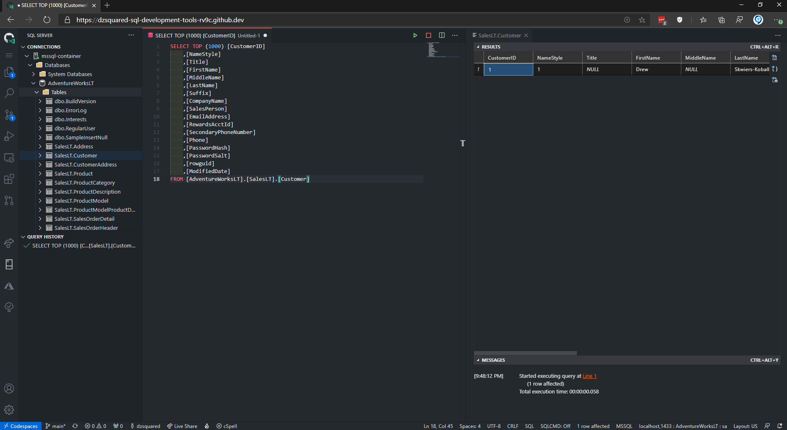

# Materials for SQL Development in a Developer's World
[Slide deck](Presentation/SQLSaturday1017.pdf)

## Abstract
Database development tooling is evolving to meet the demands of modern application development methods, including automated pipelines, cross-platform environments, and multi-dimensional architectures.  Whether you are familiar with SQL Server Data Tools (SSDT) or new to SQL projects, the SQL Database Projects extension is worth a look because it combines the Azure Data Studio interface with declarative database development capabilities. Beyond Azure Data Studio, the command line application SqlPackage.exe is a powerful tool for extracting and publishing database schemas. Add in a little magic* and let your imagination run wild with the opportunities to create efficiencies in your development workflow.

*= not actual magic

## Getting Started
Fork this repository and clone to your workstation or jump right into remote application development with Codespaces from your fork.

### In Azure Data Studio with Database Projects
After cloning your fork to your local workstation, open `AdventureWorksLT.code-workspace` in Azure Data Studio from the SQL database projects extension.

### In VS Code with .NET Core application
- After cloning your fork to your local workstation, open the folder in VS Code and use the command `Remote Containers: Rebuild and Reopen in Container`, which creates the development containers and deploys the AdventureWorksLT dacpac to the SQL container.
- After forking the repository, create a new Codespace from the repository, which creates the development containers and deploys the AdventureWorksLT dacpac to the SQL container - in GitHub.

## devcontainer Description
This definition creates two containers, one for C# (.NET Core) and one for Microsoft SQL.  VS Code will attach to the .NET Core container, and from within that container the Microsoft SQL container will be available on **`localhost`** port 1433. By default, the `sa` user password is `P@ssw0rd`. For more on the configuration of MS SQL, see the section [MS SQL Configuration](#MS-SQL-Configuration)

## MS SQL Configuration
A secondary container for MS SQL is defined in `devcontainer.json` with the Dockerfile and supporting scripts in the `mssql` folder.  This container is deployed from the latest developer edition of Microsoft SQL 2019.  The database(s) are made available directly in the Codespace/VS Code through the MSSQL extension with a connection labeled "mssql-container".  The default `sa` user password is set to `P@ssw0rd`. The default SQL port is mapped to port `1433` in `docker-compose.yml`.

### Changing the sa password
To change the `sa` user password, change the value in `docker-compose.yml` and `devcontainer.json`.

### Database deployment
By default, a blank user database is created titled "ApplicationDB".  To add additional database objects or data through T-SQL during Codespace configuration, edit the file `.devcontainer/mssql/setup.sql` or place additional `.sql` files in the `.devcontainer/mssql/` folder. *Large numbers of scripts may take a few minutes following container creation to complete, even when the SQL server is available the database(s) may not be available yet.*

Alternatively, .dacpac files placed in the `./bin/Debug` folder will be published as databases in the container during Codespace configuration. [SqlPackage](https://docs.microsoft.com/sql/tools/sqlpackage) is used to deploy a database schema from a data-tier application file (dacpac), allowing you to bring your application's database structures into the dev container easily. *The publish process may take a few minutes following container creation to complete, even when the server is available the database(s) may not be available yet.*

## License

Copyright (c) Microsoft Corporation. All rights reserved.

Licensed under the MIT License. See [LICENSE](LICENSE)

Licenses for [SqlPackage](https://docs.microsoft.com/sql/tools/sqlpackage-download), [SQLCMD](https://docs.microsoft.com/sql/linux/sql-server-linux-setup-tools), and [SQL Server Developer Edition](https://go.microsoft.com/fwlink/?linkid=857698).